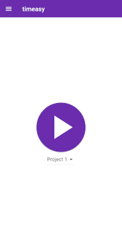
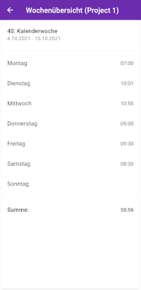
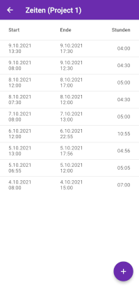

# timeasy

A time tracker application that ist build for simplicity.

Visit the timeasy website: <https://timeasy.org>

    

    

# Repository structure

This repository currently consists of two applications. 

The simple time tracking app can be found in the directory "simple-app". The app can be installed from the app store of your mobile platform with the links above.

The second app is the timeasy server that can be found in the directory "server". The server is not completed yet and it's currently not used by the app.
