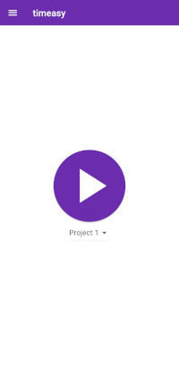
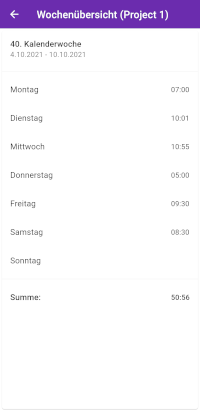
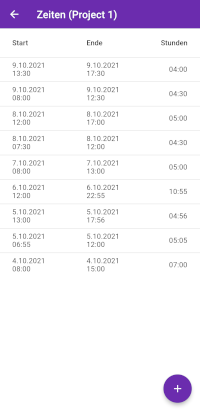

# timeasy

A time tracker application that ist build for simplicity.

Visit the timeasy website: <https://timeasy.org>

    

    

## Getting Started

### Keystore

In order to compile for Android the app needs to be signed with an appropriate key. To create a keystore and reference it please refer to the flutter documentation: https://docs.flutter.dev/deployment/android

After generating the keystore create a file named "key.properties" in the "android"-folder:

    storePassword=<password for your keystore>
    keyPassword=<password for your key>
    keyAlias=upload
    storeFile=<location of the key store file, such as /home/<user name>/keystore.jks>

### Translations

Before you begin you must generate the translation files. Otherwise the project will not be compilable:

    flutter gen-l10n

### Application icon

For setting the application icon the package "flutter_launcher_icons"
(https://pub.dev/packages/flutter_launcher_icons) is used. The configuration can be found in the
pubspec.yaml.

Just place your icon in the path configured in the pubspec.yaml and run

flutter pub run flutter_launcher_icons:main

## Using OpenTelemetry for Logging

### For Development (flutter run)

flutter run --dart-define=LOKI_ENDPOINT=<your-loki-endpoint> --dart-define=LOKI_BEARER_TOKEN=<your-bearer-token>

### For Production Builds

#### Android APK:

flutter build apk --dart-define=LOKI_ENDPOINT=<your-loki-endpoint> --dart-define=LOKI_BEARER_TOKEN=<your-bearer-token>

#### iOS:

flutter build ios --dart-define=LOKI_ENDPOINT=<your-loki-endpoint> --dart-define=LOKI_BEARER_TOKEN=<your-bearer-token>

### Additional Environment Variables

You can also optionally set these additional variables:
- ENVIRONMENT (defaults to 'development')

Example with all variables:
flutter build apk \
--dart-define=LOKI_ENDPOINT=https://your-loki-instance.com/loki/api/v1/push \
--dart-define=LOKI_BEARER_TOKEN=your_bearer_token_here \
--dart-define=ENVIRONMENT=production \

The telemetry logger will only initialize Loki logging if LOKI_ENDPOINT is provided and non-empty. If not provided, it falls
back to local console logging only.

